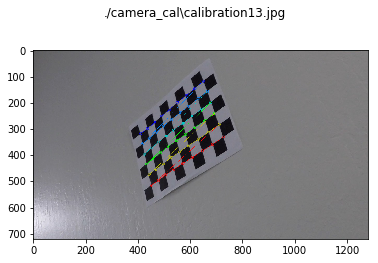
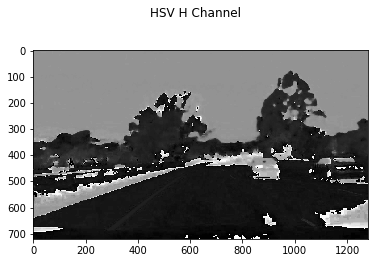
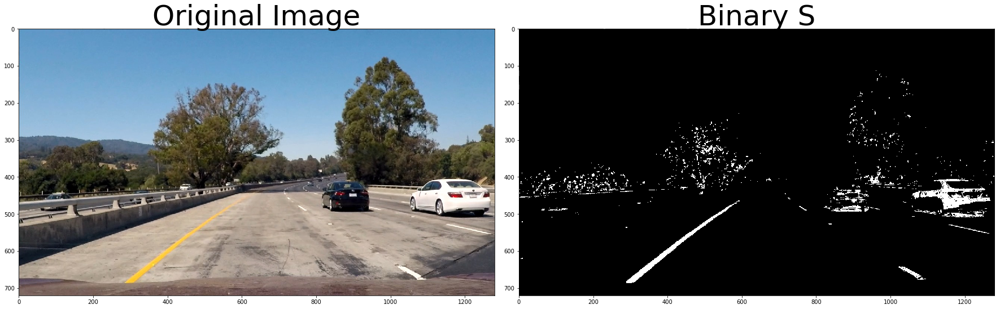
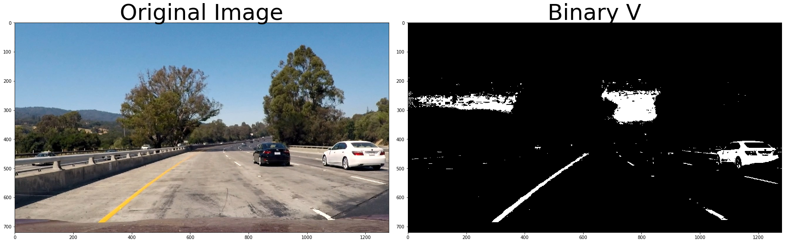
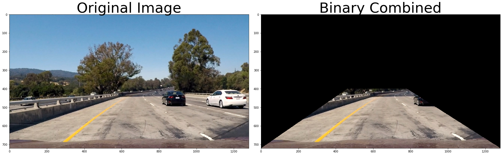
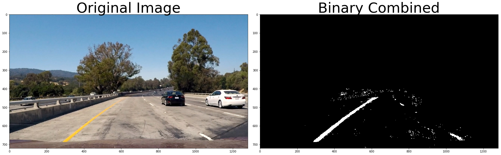

## Advanced Lane Finding Project

The goals / steps of this project are the following:

* Compute the camera calibration matrix and distortion coefficients given a set of chessboard images.
* Apply a distortion correction to raw images.
* Use color transforms, gradients, etc., to create a thresholded binary image.
* Apply a perspective transform to rectify binary image ("birds-eye view").
* Detect lane pixels and fit to find the lane boundary.
* Determine the curvature of the lane and vehicle position with respect to center.
* Warp the detected lane boundaries back onto the original image.
* Output visual display of the lane boundaries and numerical estimation of lane curvature and vehicle position.

---
## First, I'll compute the camera calibration using chessboard images


```python
import pickle
import cv2
import glob
import numpy as np
import matplotlib.pyplot as plt
import matplotlib.image as mpimg
from moviepy.editor import VideoFileClip
from IPython.display import HTML

%matplotlib inline
```

Sample of a chessboard image


```python
test_img = mpimg.imread('camera_cal/calibration3.jpg')
plt.imshow(test_img)
```


    <matplotlib.image.AxesImage at 0xbe0e898>


# Calibrate camera and test undistort

Here I have the functions used to create the calibration matrix and distortion coeficients


```python
def turn_to_gray(image):
    g_image = cv2.cvtColor(image, cv2.COLOR_BGR2GRAY)
    return g_image

def find_corner_points(image, grid_shape):
    ret, corners = cv2.findChessboardCorners(image, grid_shape, None)
    return ret, corners
    
def calibrate_camera(image, objpoints, imgpoints):
    ret, mtx, dist, rvecs, tvecs = cv2.calibrateCamera(objpoints, imgpoints, image.shape[:-1], None, None)
    return ret, mtx, dist, rvecs, tvecs
    
def cal_undistort(image, mtx, dist):
    undist = cv2.undistort(image, mtx, dist, None, mtx)
    return undist
```

Firt thing is to find the corner points in the chessboard images

Here I retrive the object points and imgpoints from the chessboard images

On the next I am going to use them to retrive the calibration matrix


```python
plot = True
grid_shape = (9, 6)
objp = np.zeros((grid_shape[1]*grid_shape[0],3), np.float32)
objp[:,:2] = np.mgrid[0:grid_shape[0],0:grid_shape[1]].T.reshape(-1,2)
objpoints = []
imgpoints = []
imgs = glob.glob('./camera_cal/calibration*.jpg')

for fname in imgs:
    img = mpimg.imread(fname)
    ret, corners =  find_corner_points(turn_to_gray(img), grid_shape)
    
    if ret == True:
        objpoints.append(objp)
        imgpoints.append(corners)
        img = cv2.drawChessboardCorners(img, grid_shape, corners, ret)
        
        if plot:
            plt.figure()        
            plt.imshow(img)
            plt.suptitle(fname)
```





Here I call the calibrate_camera function passing the calibration matrix

With that I retrieve the distortion coeficients, mtx and dist, that will on the images after


```python
ret, mtx, dist, rvecs, tvecs = calibrate_camera(test_img, objpoints, imgpoints)
undistorted = cal_undistort(test_img, mtx, dist)

f, (ax1, ax2) = plt.subplots(1, 2, figsize=(24, 9))
f.tight_layout()
ax1.imshow(test_img)
ax1.set_title('Original Image', fontsize=50)
ax2.imshow(undistorted)
ax2.set_title('Undistorted Image', fontsize=50)
plt.subplots_adjust(left=0., right=1, top=0.9, bottom=0.)
```


# Perspective shift

Next comes the perpective shift here I define two set of vectors src and dst

src is the source points vector, it represent a rectangle layed over the lane in the aproximate perpective plane of the image

dst is the destination points vector, it represents the same rectangle from an above perspective


```python
def warp_perspective(image, src_pts, dst_pts, record=False):
    img_size = (image.shape[1], image.shape[0])
    M = cv2.getPerspectiveTransform(src_pts, dst_pts)
    warped = cv2.warpPerspective(image, M, img_size)
    
    if record:
        warped[(warped == 1)] = 255
        warped_save = np.dstack((warped.astype(np.uint8), warped.astype(np.uint8), warped.astype(np.uint8)))
        mpimg.imsave("./output_images/{0}_warped.jpg".format(frame_index), warped_save)
        warped[(warped == 255)] = 1
    
    return warped, M
```

Here I select 4 point on the chessboard and I use them to shift the image perspective into a birds eye view


```python
ret, corners =  find_corner_points(turn_to_gray(undistorted), grid_shape)
offset = 100
img_size = (undistorted.shape[1], undistorted.shape[0])

src = np.float32([corners[0][0], corners[grid_shape[0]-1][0], corners[-1][0], corners[-grid_shape[0]][0]])
dst = np.float32([[offset, offset], [img_size[0]-offset, offset], 
                             [img_size[0]-offset, img_size[1]-offset], 
                             [offset, img_size[1]-offset]])

undistorted = cv2.drawChessboardCorners(undistorted, grid_shape, corners, ret)

warped, M = warp_perspective(test_img, src, dst)

f, (ax1, ax2) = plt.subplots(1, 2, figsize=(24, 9))
f.tight_layout()
ax1.imshow(undistorted)
ax1.set_title('Original Image', fontsize=50)
ax2.imshow(warped)
ax2.set_title('Perpective warped Image', fontsize=50)
plt.subplots_adjust(left=0., right=1, top=0.9, bottom=0.)
```


Here I do something similar on the pictures of the road


```python
straight_lines = mpimg.imread('test_images/straight_lines1.jpg')

print(straight_lines.shape)
pts1 = np.array([[570,460],[710,460],[1150,720],[150,720]], np.int32)
pts2 = np.array([[250,0],[1030,0],[1030,720],[250,720]], np.int32)
src = np.float32(pts1)
dst = np.float32(pts2)
pts1 = pts1.reshape((-1,1,2))
pts2 = pts2.reshape((-1,1,2))

warped, M = warp_perspective(straight_lines, src, dst)
cv2.polylines(straight_lines,[pts1],True,(255,0,0), thickness=2)
cv2.polylines(warped,[pts2],True,(255,0,0), thickness=2)

f, (ax1, ax2) = plt.subplots(1, 2, figsize=(24, 9))
f.tight_layout()
ax1.imshow(straight_lines)
ax1.set_title('Original Image', fontsize=50)
ax2.imshow(warped)
ax2.set_title('Perpective warped Image', fontsize=50)
plt.subplots_adjust(left=0., right=1, top=0.9, bottom=0.)
```

    (720, 1280, 3)
    


```python
straight_lines = mpimg.imread('test_images/straight_lines2.jpg')
straight_lines = cal_undistort(straight_lines, mtx, dist)
warped, M = warp_perspective(straight_lines, src, dst)
cv2.polylines(straight_lines,[pts1],True,(255,0,0), thickness=2)
cv2.polylines(warped,[pts2],True,(255,0,0), thickness=2)

f, (ax1, ax2) = plt.subplots(1, 2, figsize=(24, 9))
f.tight_layout()
ax1.imshow(straight_lines)
ax1.set_title('Original Image', fontsize=50)
ax2.imshow(warped)
ax2.set_title('Perpective warped Image', fontsize=50)
plt.subplots_adjust(left=0., right=1, top=0.9, bottom=0.)
```


# Tresholding

Here I define three thresholding methods to idenfy the lane lines

First sobel operator thresholding

Second magnitude thresholding

Third direction thresholding

The idea is to combine them to identify edges


```python
def gaussian_blur(img, kernel_size):
    #Applies a Gaussian Noise kernel
    return cv2.GaussianBlur(img, (kernel_size, kernel_size), 0)

def abs_sobel_thresh(gray_img, orient='x', sobel_kernel=3, thresh=(0, 255)):
    x_orient = 1 if orient == 'x' else 0
    y_orient = 0 if orient == 'x' else 1
    sobel = cv2.Sobel(gray_img, cv2.CV_64F, x_orient, y_orient, ksize=sobel_kernel)
    abs_sobel = np.absolute(sobel)
    scaled_sobel = np.uint8(255*abs_sobel/np.max(abs_sobel))
    grad_binary = np.zeros_like(scaled_sobel)
    grad_binary[(scaled_sobel >= thresh[0]) & (scaled_sobel <= thresh[1])] = 1
    return grad_binary

def mag_thresh(gray_img, sobel_kernel=3, mag_thresh=(0, 255)):
    sobelx = cv2.Sobel(gray_img, cv2.CV_64F, 1, 0, ksize=sobel_kernel)
    sobely = cv2.Sobel(gray_img, cv2.CV_64F, 0, 1, ksize=sobel_kernel)
    gradmag = np.sqrt(sobelx**2 + sobely**2)
    scaled_gradmag = np.uint8(255*gradmag/np.max(gradmag))
    mag_binary = np.zeros_like(scaled_gradmag)
    mag_binary[(scaled_gradmag >= mag_thresh[0]) & (scaled_gradmag <= mag_thresh[1])] = 1
    return mag_binary

def dir_threshold(gray_img, sobel_kernel=3, thresh=(0, np.pi/2)):
    sobelx = cv2.Sobel(gray_img, cv2.CV_64F, 1, 0, ksize=sobel_kernel)
    sobely = cv2.Sobel(gray_img, cv2.CV_64F, 0, 1, ksize=sobel_kernel)
    abs_sobelx = np.absolute(sobelx)
    abs_sobely = np.absolute(sobely)
    grad_direction = np.arctan2(abs_sobely, abs_sobelx)
    dir_binary =  np.zeros_like(grad_direction)
    dir_binary[(grad_direction >= thresh[0]) & (grad_direction <= thresh[1])] = 1
    return dir_binary
```

Here I explore combining X and Y sobel threshholdings


```python
test_img_path = './test_images/test1.jpg'
#test_img_path = './output_images/1_raw.jpg'

test_img = mpimg.imread(test_img_path)
test_img_gray = turn_to_gray(test_img)
test_img_gray = gaussian_blur(test_img_gray, 9)
result_x = abs_sobel_thresh(test_img_gray, orient='x', sobel_kernel=15, thresh=(60, 255))
result_y = abs_sobel_thresh(test_img_gray, orient='y', sobel_kernel=15, thresh=(60, 255))
combined = np.zeros_like(test_img_gray)
combined[((result_x == 1) & (result_y == 1))] = 1

f, (ax1, ax2, ax3, ax4) = plt.subplots(1, 4, figsize=(24, 9))
f.tight_layout()
ax1.imshow(test_img)
ax1.set_title('Original Image', fontsize=50)
ax2.imshow(result_x, cmap='gray')
ax2.set_title('Binary X', fontsize=50)
ax3.imshow(result_y, cmap='gray')
ax3.set_title('Binary Y', fontsize=50)
ax4.imshow(combined, cmap='gray')
ax4.set_title('Binary Combined X,Y', fontsize=50)
plt.subplots_adjust(left=0., right=1, top=0.9, bottom=0.)
```


Exploring Magnitude thresholdings


```python
test_img = mpimg.imread(test_img_path)
test_img_gray = turn_to_gray(test_img)
test_img_gray = gaussian_blur(test_img_gray, 9)
result_mag = mag_thresh(test_img_gray, sobel_kernel=15, mag_thresh=(60, 255))

f, (ax1, ax2) = plt.subplots(1, 2, figsize=(24, 9))
f.tight_layout()
ax1.imshow(test_img)
ax1.set_title('Original Image', fontsize=50)
ax2.imshow(result_mag, cmap='gray')
ax2.set_title('Binary Mag', fontsize=50)
plt.subplots_adjust(left=0., right=1, top=0.9, bottom=0.)
```


Explring direction thresholdings


```python
test_img = mpimg.imread(test_img_path)
test_img_gray = turn_to_gray(test_img)
test_img_gray = gaussian_blur(test_img_gray, 9)
result_dir = dir_threshold(test_img_gray, sobel_kernel=15, thresh=(0.63, 1.03))

f, (ax1, ax2) = plt.subplots(1, 2, figsize=(24, 9))
f.tight_layout()
ax1.imshow(test_img)
ax1.set_title('Original Image', fontsize=50)
ax2.imshow(result_dir, cmap='gray')
ax2.set_title('Binary Dir', fontsize=50)
plt.subplots_adjust(left=0., right=1, top=0.9, bottom=0.)
```


Here I combine them and display the resulting binary


```python

combined = np.zeros_like(result_x)
combined[(((result_x == 1) & (result_y == 1)) & ((result_mag == 1) & (result_dir == 1)))] = 1

f, (ax1, ax2) = plt.subplots(1, 2, figsize=(24, 9))
f.tight_layout()
ax1.imshow(test_img)
ax1.set_title('Original Image', fontsize=50)
ax2.imshow(combined, cmap='gray')
ax2.set_title('Binary Combined', fontsize=50)
plt.subplots_adjust(left=0., right=1, top=0.9, bottom=0.)
```


# Color Thresholding

Another method I will use to identify lane lines is color thresholding

Here I set a bunch of exploratory plot to verify what I can use


```python
test_img = mpimg.imread(test_img_path)

plt.imshow(test_img)
plt.suptitle("Original Image")

red = test_img[:, :, 0]

plt.figure()
plt.imshow(red, cmap='gray')
plt.suptitle("Red Channel")

green = test_img[:, :, 1]

plt.figure()
plt.imshow(green, cmap='gray')
plt.suptitle("Green Channel")


blue = test_img[:, :, 2]

plt.figure()
plt.imshow(blue, cmap='gray')
plt.suptitle("Blue Channel")


gray = turn_to_gray(test_img)

plt.figure()
plt.imshow(gray, cmap='gray')
plt.suptitle("Gray Channel")

hls = cv2.cvtColor(test_img, cv2.COLOR_RGB2HLS)

hls_h = hls[:, :, 0]

plt.figure()
plt.imshow(hls_h, cmap='gray')
plt.suptitle("HLS Hue Channel")


hls_l = hls[:, :, 1]

plt.figure()
plt.imshow(hls_l, cmap='gray')
plt.suptitle("HLS L Channel")

hls_s = hls[:, :, 2]

plt.figure()
plt.imshow(hls_s, cmap='gray')
plt.suptitle("HLS S Channel")

hsv = cv2.cvtColor(test_img, cv2.COLOR_RGB2HSV)

hsv_h = hsv[:, :, 0]

plt.figure()
plt.imshow(hsv_h, cmap='gray')
plt.suptitle("HSV H Channel")

hsv_s = hsv[:, :, 1]

plt.figure()
plt.imshow(hsv_s, cmap='gray')
plt.suptitle("HSV S Channel")

hsv_v = hsv[:, :, 2]

plt.figure()
plt.imshow(hsv_v, cmap='gray')
plt.suptitle("HSV V Channel")
```


    <matplotlib.text.Text at 0xc71a860>





And these are the resulting color threshold funtions I came up with


```python
def hls_select(image, channel=2, thresh=(0, 255)):
    hls = cv2.cvtColor(image, cv2.COLOR_RGB2HLS)
    channel = hls[:,:,channel]    
    binary_output = np.zeros_like(channel)
    binary_output[(channel > thresh[0]) & (channel <= thresh[1])] = 1
    return binary_output

def hsv_select(image, channel=2, thresh=(0, 255)):
    # 1) Convert to HLS color space
    hlv = cv2.cvtColor(image, cv2.COLOR_RGB2HSV)
    channel = hlv[:,:,channel]    
    binary_output = np.zeros_like(channel)
    binary_output[(channel > thresh[0]) & (channel <= thresh[1])] = 1
    return binary_output

def red_select(image, thresh=(0, 255)):
    R = image[:,:,0]
    binary_output = np.zeros_like(R)
    binary_output[(R > thresh[0]) & (R <= thresh[1])] = 1
    return binary_output
```

Here I explore the many options of thresholding and I visualize them


```python
test_img = mpimg.imread(test_img_path)
result_s = hls_select(test_img, thresh=(150, 255))

f, (ax1, ax2) = plt.subplots(1, 2, figsize=(24, 9))
f.tight_layout()
ax1.imshow(test_img)
ax1.set_title('Original Image', fontsize=50)
ax2.imshow(result_s, cmap='gray')
ax2.set_title('Binary S', fontsize=50)
plt.subplots_adjust(left=0., right=1, top=0.9, bottom=0.)
```





```python
test_img = mpimg.imread(test_img_path)
result_r = red_select(test_img, thresh=(220, 255))

f, (ax1, ax2) = plt.subplots(1, 2, figsize=(24, 9))
f.tight_layout()
ax1.imshow(test_img)
ax1.set_title('Original Image', fontsize=50)
ax2.imshow(result_r, cmap='gray')
ax2.set_title('Binary R', fontsize=50)
plt.subplots_adjust(left=0., right=1, top=0.9, bottom=0.)
```


```python
test_img = mpimg.imread(test_img_path)
result_v = hsv_select(test_img, thresh=(220, 255))

f, (ax1, ax2) = plt.subplots(1, 2, figsize=(24, 9))
f.tight_layout()
ax1.imshow(test_img)
ax1.set_title('Original Image', fontsize=50)
ax2.imshow(result_v, cmap='gray')
ax2.set_title('Binary V', fontsize=50)
plt.subplots_adjust(left=0., right=1, top=0.9, bottom=0.)
```





Now I combine color thresholding and edge detection thresholding


```python
def region_of_interest(img, vertices):
    mask = np.zeros_like(img)   
    
    #defining a 3 channel or 1 channel color to fill the mask with depending on the input image
    if len(img.shape) > 2:
        channel_count = img.shape[2]  # i.e. 3 or 4 depending on your image
        ignore_mask_color = (255,) * channel_count
    else:
        ignore_mask_color = 255
        
    #filling pixels inside the polygon defined by "vertices" with the fill color    
    cv2.fillPoly(mask, vertices, ignore_mask_color)
    
    #returning the image only where mask pixels are nonzero
    masked_image = cv2.bitwise_and(img, mask)
    return masked_image
```


```python
test_img_masked = region_of_interest(test_img, np.array([[(0,test_img.shape[0]),(460, 400), (780, 400), (test_img.shape[1],test_img.shape[0])]], dtype=np.int32))

f, (ax1, ax2) = plt.subplots(1, 2, figsize=(24, 9))
f.tight_layout()
ax1.imshow(test_img)
ax1.set_title('Original Image', fontsize=50)
ax2.imshow(test_img_masked, cmap='gray')
ax2.set_title('Binary Combined', fontsize=50)
plt.subplots_adjust(left=0., right=1, top=0.9, bottom=0.)
```





```python
def get_thresholded_binary(frame, record):
    frame_gray = turn_to_gray(frame)
    ksize = 15
    # Apply region of interest
    
    
    # Apply each of the thresholding functions
    thresholded_x = abs_sobel_thresh(frame_gray, orient='x', sobel_kernel=ksize, thresh=(20, 255))
    thresholded_y = abs_sobel_thresh(frame_gray, orient='y', sobel_kernel=ksize, thresh=(30, 255))
    thresholded_mag = mag_thresh(frame_gray, sobel_kernel=ksize, mag_thresh=(30, 255))
    thresholded_dir = dir_threshold(frame_gray, sobel_kernel=ksize, thresh=(.65, 1.05))
    thresholded_s = hls_select(frame, thresh=(85, 255))
    thresholded_r = red_select(frame, thresh=(195, 255))
    thresholded_v = hsv_select(test_img, thresh=(195, 255))
    
    # Combine all the thresholding information
    combined_binary = np.zeros_like(thresholded_x)
    combined_binary[((thresholded_x == 1) & (thresholded_y == 1) & (thresholded_mag == 1) & (thresholded_dir == 1)) | ((thresholded_s == 1) & (thresholded_r == 1) & (thresholded_v == 1))] = 1
    
    if record:
        combined_binary[(combined_binary == 1)] = 255
        binary_save = np.dstack((combined_binary.astype(np.uint8), combined_binary.astype(np.uint8), combined_binary.astype(np.uint8)))
        mpimg.imsave("./output_images/{0}_binary.jpg".format(frame_index), binary_save)
        combined_binary[(combined_binary == 255)] = 1

    combined_binary = region_of_interest(combined_binary, np.array([[(0,frame.shape[0]),(460, 400), (780, 400), (frame.shape[1],frame.shape[0])]], dtype=np.int32))
    return combined_binary
    
```


```python
combined = get_thresholded_binary(test_img, False)

f, (ax1, ax2) = plt.subplots(1, 2, figsize=(24, 9))
f.tight_layout()
ax1.imshow(test_img)
ax1.set_title('Original Image', fontsize=50)
ax2.imshow(combined, cmap='gray')
ax2.set_title('Binary Combined', fontsize=50)
plt.subplots_adjust(left=0., right=1, top=0.9, bottom=0.)
```





# Lane Finding

In order to calculate the curvature and identify the lane warp the thresholded image to a birdseye view


```python
warped = combined
warped, M = warp_perspective(warped, src, dst)
cv2.polylines(test_img,[pts1],True,(255,0,0), thickness=2)

out_img = np.dstack((warped, warped, warped))*255

f, (ax1, ax2) = plt.subplots(1, 2, figsize=(24, 9))
f.tight_layout()
ax1.imshow(test_img)
ax1.set_title('Original Image', fontsize=50)
ax2.imshow(out_img, cmap='gray')
ax2.set_title('Perpective warped Image', fontsize=50)
plt.subplots_adjust(left=0., right=1, top=0.9, bottom=0.)
```


```python
class LaneLines():
    def __init__(self, h, lf, rf, nzy, nzx, lli, rli, lx, ly, rx, ry, lb, rb):
        self.histogram = h
        self.left_fit = lf
        self.right_fit = rf
        self.nonzeroy = nzy
        self.nonzerox = nzx
        self.left_lane_inds = lli
        self.right_lane_inds = rli
        self.leftx = lx
        self.lefty = ly
        self.rightx = rx
        self.righty = ry
        self.left_base = lb
        self.right_base = rb
```


```python
def find_lane_lines(warped_img, left_fit, right_fit):    
    histogram = np.sum(warped_img[warped_img.shape[0]/2:,:], axis=0)    
    midpoint = np.int(histogram.shape[0]/2)
    leftx_base = np.argmax(histogram[:midpoint])
    rightx_base = np.argmax(histogram[midpoint:]) + midpoint

    nwindows = 6
    # Set height of windows
    window_height = np.int(warped_img.shape[0]/nwindows)
    # Identify the x and y positions of all nonzero pixels in the image
    nonzero = warped_img.nonzero()
    nonzeroy = np.array(nonzero[0])
    nonzerox = np.array(nonzero[1])
    # Current positions to be updated for each window
    leftx_current = leftx_base
    rightx_current = rightx_base
    # Set the width of the windows +/- margin
    margin = 100
    # Set minimum number of pixels found to recenter window
    minpix = 50
    # Create empty lists to receive left and right lane pixel indices
    left_lane_inds = []
    right_lane_inds = []

    if (right_fit == None or right_fit == None):
        for window in range(nwindows):
            # Identify window boundaries in x and y (and right and left)
            win_y_low = warped_img.shape[0] - (window+1)*window_height
            win_y_high = warped_img.shape[0] - window*window_height
            win_xleft_low = leftx_current - margin
            win_xleft_high = leftx_current + margin
            win_xright_low = rightx_current - margin
            win_xright_high = rightx_current + margin
            # Draw the windows on the visualization image
            cv2.rectangle(out_img,(win_xleft_low,win_y_low),(win_xleft_high,win_y_high),(0,255,0), 2) 
            cv2.rectangle(out_img,(win_xright_low,win_y_low),(win_xright_high,win_y_high),(0,255,0), 2) 
            # Identify the nonzero pixels in x and y within the window
            good_left_inds = ((nonzeroy >= win_y_low) & (nonzeroy < win_y_high) & (nonzerox >= win_xleft_low) & (nonzerox < win_xleft_high)).nonzero()[0]
            good_right_inds = ((nonzeroy >= win_y_low) & (nonzeroy < win_y_high) & (nonzerox >= win_xright_low) & (nonzerox < win_xright_high)).nonzero()[0]
            # Append these indices to the lists
            left_lane_inds.append(good_left_inds)
            right_lane_inds.append(good_right_inds)
            # If you found > minpix pixels, recenter next window on their mean position
            if len(good_left_inds) > minpix:
                leftx_current = np.int(np.mean(nonzerox[good_left_inds]))
            if len(good_right_inds) > minpix:        
                rightx_current = np.int(np.mean(nonzerox[good_right_inds]))

        # Concatenate the arrays of indices
        left_lane_inds = np.concatenate(left_lane_inds)
        right_lane_inds = np.concatenate(right_lane_inds)
    else:
        left_lane_inds = ((nonzerox > (left_fit[0]*(nonzeroy**2) + left_fit[1]*nonzeroy + left_fit[2] - margin)) & (nonzerox < (left_fit[0]*(nonzeroy**2) + left_fit[1]*nonzeroy + left_fit[2] + margin))) 
        right_lane_inds = ((nonzerox > (right_fit[0]*(nonzeroy**2) + right_fit[1]*nonzeroy + right_fit[2] - margin)) & (nonzerox < (right_fit[0]*(nonzeroy**2) + right_fit[1]*nonzeroy + right_fit[2] + margin)))  

    # Extract left and right line pixel positions
    leftx = nonzerox[left_lane_inds]
    lefty = nonzeroy[left_lane_inds] 
    rightx = nonzerox[right_lane_inds]
    righty = nonzeroy[right_lane_inds] 

    # Fit a second order polynomial to each
    left_fit = np.polyfit(lefty, leftx, 2)
    right_fit = np.polyfit(righty, rightx, 2)
    return LaneLines(histogram, left_fit, right_fit, nonzeroy, nonzerox, left_lane_inds, right_lane_inds, leftx, lefty, rightx, righty, leftx_base, rightx_base)
```

Them by using the histogram of half of the image I identify the two most proeminent peaks as the most probable place to start looking for the lines.

By doing so I will clear most of the noise pixels that don't belong to the lane lines


```python
info = find_lane_lines(warped, None, None)

plt.plot(info.histogram)
axes = plt.gca()
axes.set_xlim([0,1280])
axes.set_ylim([0,500])
```


    (0, 500)


with these peaks I also identify the position of the car in relation to the lane center


```python
print("Left Base: ", info.right_base)
print("Left Base: ", info.left_base)
print("Center: ", warped.shape[1]/2)
xm_per_pix = 3.7/700

print("Offset: ", ((warped.shape[1]/2)-(info.left_base + ((info.right_base - info.left_base)/2)))*xm_per_pix)
```

    Left Base:  1034
    Left Base:  318
    Center:  640.0
    Offset:  -0.190285714286
    

Here I plot how the moving window search identifies lane pixels


```python
ploty = np.linspace(0, warped.shape[0]-1, warped.shape[0] )
left_fitx = info.left_fit[0]*ploty**2 + info.left_fit[1]*ploty + info.left_fit[2]
right_fitx = info.right_fit[0]*ploty**2 + info.right_fit[1]*ploty + info.right_fit[2]

out_img[info.nonzeroy[info.left_lane_inds], info.nonzerox[info.left_lane_inds]] = [255, 0, 0]
out_img[info.nonzeroy[info.right_lane_inds], info.nonzerox[info.right_lane_inds]] = [0, 0, 255]
plt.imshow(out_img)
plt.plot(left_fitx, ploty, color='yellow')
plt.plot(right_fitx, ploty, color='yellow')
plt.xlim(0, 1280)
plt.ylim(720, 0)
```


    (720, 0)


And then how once I have lane fits I just look for the next lane lines inside a margin window of the previuos fit


```python
info = find_lane_lines(warped, info.left_fit, info.right_fit)

# Generate x and y values for plotting
ploty = np.linspace(0, warped.shape[0]-1, warped.shape[0] )
left_fitx = info.left_fit[0]*ploty**2 + info.left_fit[1]*ploty + info.left_fit[2]
right_fitx = info.right_fit[0]*ploty**2 + info.right_fit[1]*ploty + info.right_fit[2]
```


```python
margin = 100
out_img = np.dstack((warped, warped, warped))*255
window_img = np.zeros_like(out_img)
# Color in left and right line pixels
out_img[info.nonzeroy[info.left_lane_inds], info.nonzerox[info.left_lane_inds]] = [255, 0, 0]
out_img[info.nonzeroy[info.right_lane_inds], info.nonzerox[info.right_lane_inds]] = [0, 0, 255]

# Generate a polygon to illustrate the search window area
# And recast the x and y points into usable format for cv2.fillPoly()
left_line_window1 = np.array([np.transpose(np.vstack([left_fitx-margin, ploty]))])
left_line_window2 = np.array([np.flipud(np.transpose(np.vstack([left_fitx+margin, ploty])))])
left_line_pts = np.hstack((left_line_window1, left_line_window2))
right_line_window1 = np.array([np.transpose(np.vstack([right_fitx-margin, ploty]))])
right_line_window2 = np.array([np.flipud(np.transpose(np.vstack([right_fitx+margin, ploty])))])
right_line_pts = np.hstack((right_line_window1, right_line_window2))

# Draw the lane onto the warped blank image
cv2.fillPoly(window_img, np.int_([left_line_pts]), (0,255, 0))
cv2.fillPoly(window_img, np.int_([right_line_pts]), (0,255, 0))
windowed = cv2.addWeighted(out_img, 1, window_img, 0.3, 0)
plt.imshow(windowed)
plt.plot(left_fitx, ploty, color='yellow')
plt.plot(right_fitx, ploty, color='yellow')
plt.xlim(0, 1280)
plt.ylim(720, 0)
```


    (720, 0)


```python
y_eval = np.max(ploty)
left_curverad = ((1 + (2*info.left_fit[0]*y_eval + info.left_fit[1])**2)**1.5) / np.absolute(2*info.left_fit[0])
right_curverad = ((1 + (2*info.right_fit[0]*y_eval + info.right_fit[1])**2)**1.5) / np.absolute(2*info.right_fit[0])
print(left_curverad, right_curverad)
```

    10308.7087088 7377.493649
    

Next thing to do is calculta the curvature in pixels (above) then in meters (below)


```python
def calculate_curvature(ly, lx, ry, rx, py):
    y_eval = np.max(py)
    ym_per_pix = 30/720 # meters per pixel in y dimension
    xm_per_pix = 3.7/700 # meters per pixel in x dimension

    # Fit new polynomials to x,y in world space
    left_fit_cr = np.polyfit(ly*ym_per_pix, lx*xm_per_pix, 2)
    right_fit_cr = np.polyfit(ry*ym_per_pix, rx*xm_per_pix, 2)
    # Calculate the new radii of curvature
    left_curverad = ((1 + (2*left_fit_cr[0]*y_eval*ym_per_pix + left_fit_cr[1])**2)**1.5) / np.absolute(2*left_fit_cr[0])
    right_curverad = ((1 + (2*right_fit_cr[0]*y_eval*ym_per_pix + right_fit_cr[1])**2)**1.5) / np.absolute(2*right_fit_cr[0])
    return left_curverad, right_curverad
```


```python
left_curverad, right_curverad = calculate_curvature(info.lefty, info.leftx, info.righty, info.rightx, ploty)
# Now our radius of curvature is in meters
print(left_curverad, 'm', right_curverad, 'm')
```

    3352.58338868 m 2396.47488826 m
    

This method will draw the previously detected lines into the original image


```python
def draw_detected_lane(warped_image, original, lfitx, rfitx, py, src_pts, dst_pts):
    
    if original.shape[2] > 3:
        original = original[:,:, 0:3]
        
    # Create an image to draw the lines on
    warp_zero = np.zeros_like(warped_image).astype(np.uint8)
    color_warp = np.dstack((warp_zero, warp_zero, warp_zero))

    # Recast the x and y points into usable format for cv2.fillPoly()
    left_pixels = np.array([np.transpose(np.vstack([lfitx, py]))])
    right_pixels = np.array([np.flipud(np.transpose(np.vstack([rfitx, py])))])
    pixels = np.hstack((left_pixels, right_pixels))

    # Draw the lane onto the warped blank image
    cv2.fillPoly(color_warp, np.int_([pixels]), (0,255,0))
    
    # Warp the blank back to original image space using inverse perspective matrix (Minv)
    new_warp, M = warp_perspective(color_warp, dst_pts, src_pts) 
    # Combine the result with the original image
    result = cv2.addWeighted(original, 1, new_warp, 0.3, 0)
    return result
```


```python
test_img = mpimg.imread(test_img_path)
result = draw_detected_lane(warped, test_img, left_fitx, right_fitx, ploty, src, dst)
plt.imshow(result)
```


    <matplotlib.image.AxesImage at 0xd6df6d8>


# Pipeline

Below I join all the methods above to 

    undistort the image
    threshold it
    warp it to birdseye a view
    identfy lane lines
    calculate curvature and offsets
    and draw the lane, curvature and offset onto the original image


```python
imgs = glob.glob('./test_images/*.jpg')
frame_index = 0

for fname in imgs:
    img = mpimg.imread(fname)
    img = get_thresholded_binary(img, False)
    plt.figure()
    plt.imshow(img, cmap='gray')
    plt.suptitle(fname)
```


```python
class Line():
    def __init__(self, memmory_len=5):
        self.recent_fits = []
        self.mean_fit = None
        self.memmory_len = memmory_len
    
    def sanity_check(self, fit):
        return (np.mean((fit/self.mean_fit))-1 < 0.5)
        
    def add_fit(self, fit):

        if len(self.recent_fits) >= self.memmory_len:
            if not self.sanity_check(fit):
                return
            
            self.recent_fits.pop(0)
            
        self.recent_fits.append(fit)
        self.mean_fit = np.mean(self.recent_fits, axis=0)
        
        
        
        
```


```python

def process_image(frame):
    global frame_index
    global src
    global dst
    global mtx
    global dist
    global left_line
    global right_line
    
    record = False
    frame_index += 1
    
    if record:
        mpimg.imsave("./output_images/{0}_raw.jpg".format(frame_index), frame)
        
    undistorted_frame = cal_undistort(frame, mtx, dist)
    combined_binary = get_thresholded_binary(undistorted_frame, record)
    warped_binary, M = warp_perspective(combined_binary, src, dst, record)
    
    left_fit = left_line.mean_fit
    right_fit = right_line.mean_fit
    
    lineInfo = find_lane_lines(warped_binary, left_fit, right_fit)
    
    left_line.add_fit(lineInfo.left_fit)
    right_line.add_fit(lineInfo.right_fit)
    
    left_fit = left_line.mean_fit
    right_fit = right_line.mean_fit
    
    ploty = np.linspace(0, warped_binary.shape[0]-1, warped_binary.shape[0])
    left_fitx = lineInfo.left_fit[0]*ploty**2 + lineInfo.left_fit[1]*ploty + lineInfo.left_fit[2]
    right_fitx = lineInfo.right_fit[0]*ploty**2 + lineInfo.right_fit[1]*ploty + lineInfo.right_fit[2]
    
    result = draw_detected_lane(warped_binary, frame, left_fitx, right_fitx, ploty, src, dst)
    left_curverad, right_curverad = calculate_curvature(lineInfo.lefty, lineInfo.leftx, lineInfo.righty, lineInfo.rightx, ploty)
    
    xm_per_pix = 3.7/700
    offset = ((warped_binary.shape[1]/2)-(lineInfo.left_base + ((lineInfo.right_base - lineInfo.left_base)/2)))*xm_per_pix
    curvature = (left_curverad + right_curverad)/2
    text = "Curvature Radius: {0} m Offset: {1} m".format(int(curvature), round(offset, 2))
    cv2.putText(result, text, (300,100), cv2.FONT_HERSHEY_SIMPLEX, 1, (255,255,255),2)
    
        
    if record:
        mpimg.imsave("./output_images/{0}_result.jpg".format(frame_index), result)
        
    return result
```


```python
imgs = glob.glob('./test_images/*.jpg')
frame_index = 0

for fname in imgs:
    left_line = Line()
    right_line = Line()
    img = mpimg.imread(fname)
    img = process_image(img)
    plt.figure()        
    plt.imshow(img)
    plt.suptitle(fname)
```


```python
frame_index = 0
left_line = Line()
right_line = Line()
output = 'output_images/project.mp4'
clip1 = VideoFileClip("project_video.mp4")
processed_clip = clip1.fl_image(process_image)
%time processed_clip.write_videofile(output, audio=False)
```

    [MoviePy] >>>> Building video output_images/project.mp4
    [MoviePy] Writing video output_images/project.mp4
    

    100%|█████████▉| 1260/1261 [07:07<00:00,  3.02it/s]
    

    [MoviePy] Done.
    [MoviePy] >>>> Video ready: output_images/project.mp4 
    
    Wall time: 7min 8s
    


```python
HTML("<video width=\"960\" height=\"540\" controls><source src=\"{0}\"></video>".format(output))
```


<video width="960" height="540" controls><source src="output_images/project.mp4"></video>


# Discussion

In this project one of my greatest challenges was my own organization of the code insetead of a technical one.

I am still in need of a better algo to keep track of smothed lines because in some places few place this would be beneficial]

I also didn't have time to take a look into the harder challenges, I will revisit this project later do improve this, and do more avaraging and sanity checks.
 
But I am pretty confidend that the thresholds selected are going to do a good job.

Also I feel that the algo might fail if no lines at all are found, in which case I will have to implement some robustness, for for this project what I have so far is enough. But I think it was good to try extracting the most of the images without avaraging so when I implement it will be very robust.


